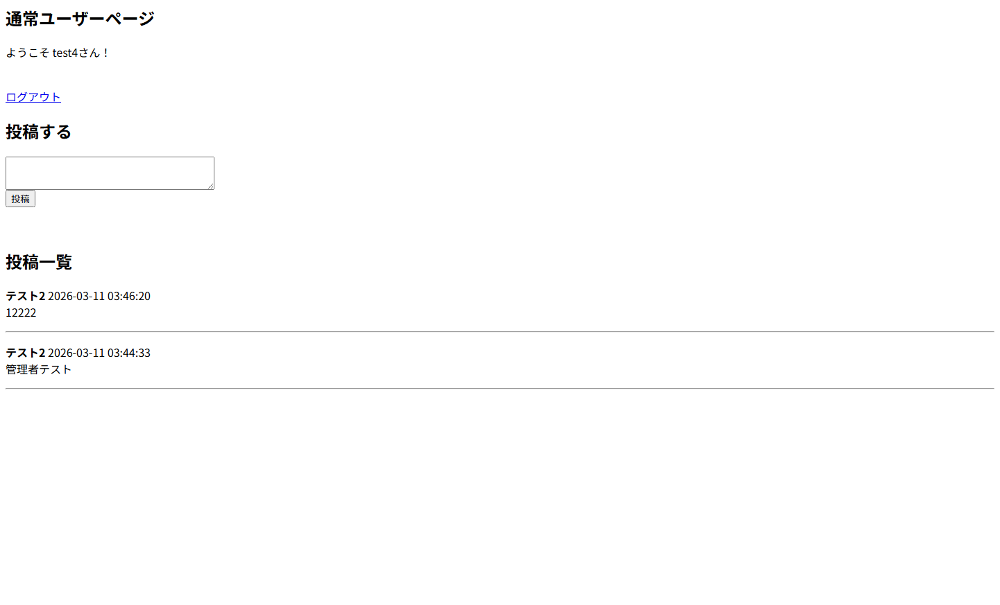
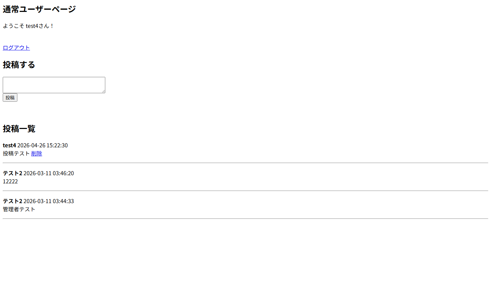

# PHP BBS（ログイン機能付き掲示板サイト）

## 概要
PHPとMySQLを使用して作成したシンプルな掲示板サイトです。  
ユーザー登録・ログイン後に投稿できる掲示板機能を実装しています。  
機能ごとにファイルを分割することで、処理の役割を明確にし、シンプルで理解しやすい構成になるよう設計しました。

## 画面イメージ

### ログイン

### 一般ユーザーページ

### 管理者ページ

### ユーザー登録

## 主な機能
・ユーザー登録  
・ログイン / ログアウト  
・投稿内容の登録  
・投稿一覧の表示  
・投稿削除機能  
・管理者用ページ  
・セッションによるログイン管理  

## 使用技術
・PHP  
・MySQL  
・HTML  

## 設計方針
処理の役割ごとにPHPファイルを分割し、  
「ログイン」「投稿処理」「投稿取得」「削除処理」などを  
それぞれ独立させることで、コードの見通しを良くすることを意識しました。

例  
・login.php：ログイン処理  
・process_post.php：投稿処理  
・get_posts.php：投稿取得  
・delete.php：投稿削除  

## 動作環境
本アプリケーションはPHPとMySQLを使用しているため、  
ローカル開発環境（XAMPP）で動作確認を行っています。

## セットアップ方法

1. リポジトリをクローン

git clone https://github.com/z-at-0/portfolio-No-004.git

2. XAMPPなどのローカル環境を起動（Apache / MySQL）

3. データベースを作成  
例：bbs

4. 以下のSQLを実行してテーブルを作成

CREATE TABLE users (
    id INT AUTO_INCREMENT PRIMARY KEY,
    name VARCHAR(50) NOT NULL,
    email VARCHAR(255) NOT NULL UNIQUE,
    password VARCHAR(255) NOT NULL,
    role VARCHAR(20) DEFAULT 'user',
    created_at DATETIME DEFAULT CURRENT_TIMESTAMP
);

CREATE TABLE posts (
    id INT AUTO_INCREMENT PRIMARY KEY,
    user_id INT NOT NULL,
    content TEXT NOT NULL,
    created_at DATETIME DEFAULT CURRENT_TIMESTAMP,
    FOREIGN KEY (user_id) REFERENCES users(id)
);

5. ブラウザでアクセス

http://localhost/portfolio-No-004/php/

## ディレクトリ構成

portfolio-No-004  
├ php  
│ ├ index.php  
│ ├ home.php  
│ ├ admin_home.php  
│ ├ login.php  
│ ├ logout.php  
│ ├ register.php  
│ ├ process_post.php  
│ ├ get_posts.php  
│ ├ delete.php  
│ └ db.php  
├ img

## 学習ポイント
・PHPによるフォーム処理  
・PDOを使用したMySQLデータベース接続  
・セッションによるログイン管理  
・機能ごとにファイルを分割したシンプルな構成

【現実ベース修正版（コピペ用）】

## AI活用について

本プロジェクトでは、実装理解およびデバッグ補助の目的でAIツール（ChatGPT）を活用しています。

### ■ 活用範囲
・サンプルコードや提案コードを参考にしながら、手動で入力し各処理の意味を確認  
・非同期処理（async/await, AbortController）やイベント委譲の理解補助  
・PHPにおけるセッション管理、PDOを用いたDB操作の理解補助  
・エラー原因の特定およびデバッグ支援  
・コードの整理（可読性・処理の分割）の検討

### ■ 主体性について
コードは手動で入力し、一行ずつ挙動を確認しながら理解を進めています。  
AIの出力はそのまま使用せず、内容を検証・理解した上で採用しています。

### ■ 補足
本ポートフォリオでは、フロントエンドにおける非同期処理やイベント制御、バックエンドにおけるログイン機能・セッション管理・DB連携など、基礎的な仕組みの理解を重視しています。AIは学習および実装補助として活用しています。
